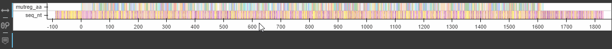

# seequence
Display/explore (bio)sequences with Bokeh

Example:

```python
from view import *
from color import *

sequence_nt = 'CAAAGCCCAGCACCTGCCGCAGCGCCTGCCCCTGCGGCACGTTCCATCGCAGCTACGCCTCCTAAACTGATCGTGGCAATTAGCGTGGACCAGTTTAGTGCAGACTTGTTCTCGGAGTATCGTCAATATTACACCGGAGGTTTAAAGCGTCTTACATCCGAAGGAGCTGTGTTCCCACGTGGTTATCAGAGTCATGCGGCAACAGAAACGTGTCCTGGTCACTCAACGATCCTGACAGGATCACGTCCGTCACGTACGGGTATTATCGCTAATAACTGGTTCGACTTGGACGCAAAGCGTGAGGATAAAAATCTGTACTGTGCTGAGGATGAATCCCAACCCGGTAGTTCGTCTGACAAGTACGAAGCTTCGCCACTGCACTTAAAGGTACCCACCCTGGGGGGACGCATGAAAGCCGCCAATCCTGCGACTCGTGTCGTCTCTGTTGCCGGCAAGGATCGCGCGGCCATTATGATGGGTGGCGCCACAGCGGATCAGGTCTGGTGGTTAGGGGGGCCTCAGGGGTATGTTTCGTATAAGGGTGTAGCGCCAACTCCCCTTGTAACACAGGTCAATCAGGCCTTTGCACAGCGCTTAGCTCAGCCGAACCCGGGATTTGAGTTGCCTGCTCAGTGCGTCAGCAAGGACTTTCCTGTTCAAGCGGGAAATCGCACAGTGGGTACCGGCCGCTTCGCCCGTGATGCTGGTGACTACAAAGGTTTTCGCATTTCCCCGGAGCAGGATGCTATGACGCTTGCATTCGCTGCCGCGGCCATTGAAAATATGCAATTAGGGAAGCAGGCCCAGACCGATATTATTAGCATTGGACTGAGCGCTACGGATTACGTGGGACACACCTTCGGCACGGAGGGTACGGAGAGTTGCATCCAAGTGGATCGTTTAGACACGGAGCTTGGTGCATTCTTTGATAAACTGGATAAGGATGGGATTGACTACGTAGTAGTGCTGACTGCAGATCATGGAGGACACGATCTGCCCGAACGTCATCGTATGAATGCCATGCCGATGGAACAGCGCGTAGACATGGCCCTGACACCTAAAGCTCTGAATGCTACCATCGCTGAGAAAGCTGGCCTTCCGGGCAAAAAGGTTATTTGGTCAGATGGACCTTCTGGCGATATTTACTATGATAAGGGCCTTACAGCCGCTCAACGTGCCCGTGTTGAAACCGAGGCGTTAAAATACTTGCGCGCGCATCCCCAAGTACAGACTGTATTCACTAAGGCGGAAATCGCGGCTACCCCTTCTCCGTCGGGACCACCTGAGAGCTGGAGTTTGATCCAGGAAGCTCGCGCGTCATTTTACCCGTCGCGCTCCGGGGACCTGTTACTTTTATTGAAACCTCGTGTGATGAGCATTCCTGAGCAAGCAGTCATGGGCTCGGTTGCAACCCATGGATCTCCATGGGATACGGATCGCCGTGTGCCTATCCTGTTTTGGCGCAAAGGTATGCAGCATTTCGAACAACCCTTAGGAGTAGAGACTGTTGATATTTTGCCCTCCTTGGCTGCACTTATTAAGCTTCCTGTTCCTAAGGATCAGATCGACGGCCGCTGTCTGGACTTGGTCGCCGGCAAGGATGATTCCTGTGCTGGACAG'
mutreg_aa = 'QSPAPAAAPAPAARSIAATPPKLIVAISVDQFSADLFSEYRQYYTGGLKRLTSEGAVFPRGYQSHAATETCPGHSTILTGSRPSRTGIIANNWFDLDAKREDKNLYCAEDESQPGSSSDKYEASPLHLKVPTLGGRMKAANPATRVVSVAGKDRAAIMMGGATADQVWWLGGPQGYVSYKGVAPTPLVTQVNQAFAQRLAQPNPGFELPAQCVSKDFPVQAGNRTVGTGRFARDAGDYKGFRISPEQDAMTLAFAAAAIENMQLGKQAQTDIISIGLSATDYVGHTFGTEGTESCIQVDRLDTELGAFFDKLDKDGIDYVVVLTADHGGHDLPERHRMNAMPMEQRVDMALTPKALNATIAEKAGLPGKKVIWSDGPSGDIYYDKGLTAAQRARVETEALKYLRAHPQVQTVFTKAEIAATPSPSGPPESWSLIQEARASFYPSRSGDLLLLLKPRVMSIPEQAVMGSVATHGSPWDTDRRVPILFWRKGMQHFEQPLGVETVDILPSLAALIKLPVPKDQIDGRCLDLVAGKDDSCAGQ'

f_ls = []
f_ls.append(view_seq(seq = sequence_nt,
                     layer = 'seq_nt',
                     start = -90))
f_ls.append(view_seq(seq = mutreg_aa,
                     layer = 'mutreg_aa',
                     start = 0,
                     scale = 3,
                     xr = f_ls[0].x_range))
f_ls = list(reversed(f_ls))
gp = gridplot(f_ls, ncols=1,
              toolbar_location='left', toolbar_options={'logo':None})
show(gp)
```
